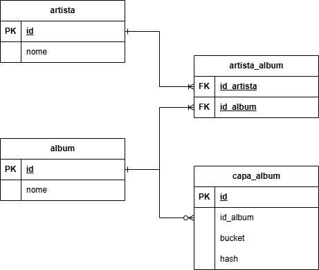
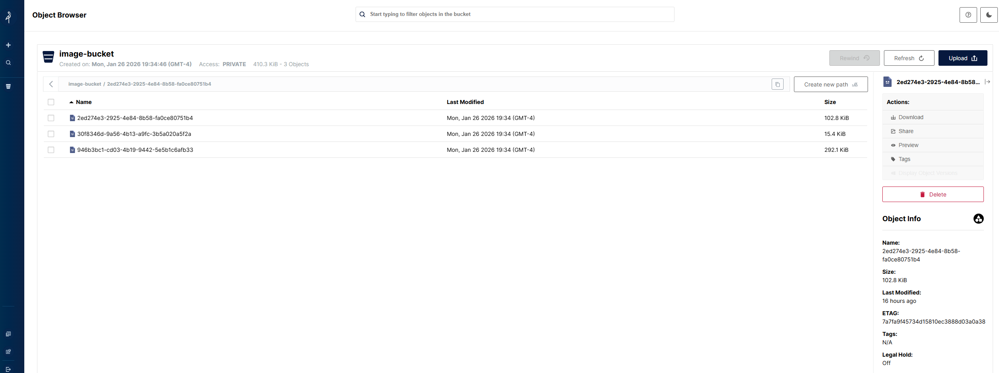
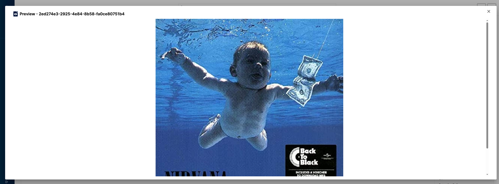
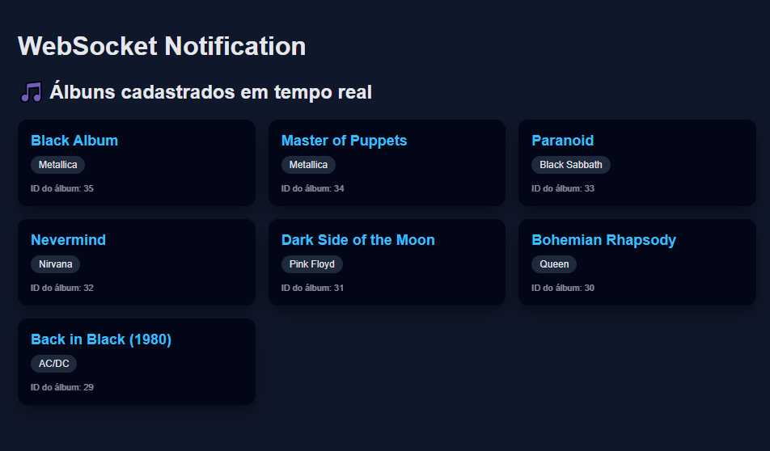

# EDITAL DE PROCESSO SELETIVO 001/2026/SEPLAG/SEFAZ/SEDUC/SESP/PJC/PMMT/CBMMT/DETRAN/POLITEC/SEJUS/SEMA/SE

>NÚMERO DE INSCRIÇÃO: 16310</br>
>CARGO: ANALISTA DE TECNOLOGIA DA INFORMAÇÃO</br>
>PERFIL: ENGENHEIRO DA COMPUTAÇÃO - SÊNIOR</br>


## Anexo II - A - Projeto Desenvolvedor Backend

API REST para disponibilizar dados referentes à artistas e álbuns.

### Pre-requisitos

- [Java 21 (openjdk-21.0.2)](https://jdk.java.net/archive/)
- [Maven (3.9.11)](https://maven.apache.org/docs/3.9.11/release-notes.html)
- [Docker Desktop](https://www.docker.com/)
- [Docker Compose](https://docs.docker.com/compose/)
- [Mise tools (opcional)](https://mise.jdx.dev/dev-tools/)

### Execução com docker compose

Para executar a API, execute o seguinte comando docker:

```bash
docker compose up -d
```

Para verificar os logs dos serviços levantados.
```bash
docker compose logs
```

Finalizar a execução do projeto
```bash
docker compose down
```

### Variáveis de Ambiente

As variáveis de ambiente necessárias para a execução da API estão no arquivo .env

| Variável                     | Descrição                                         |
|------------------------------|---------------------------------------------------|
| JDBC_POSTGRES_URL            | URL de conexão com banco de dados                 |
| JDBC_POSTGRES_USER           | Usuário de conexão com banco de dados             |
| JDBC_POSTGRES_PASSWORD       | Senha de conexão com banco de dados               |
| HIBERNATE_SHOW_SQL           | Mostra as queries SQL no console                  |
| HIBERNATE_FORMAT_SQL         | Formata as queries SQL no console                 |
| SPRINGDOC_API_DOCS_ENABLED   | Habilita a documentação da API                    |
| SPRINGDOC_SWAGGER_UI_ENABLED | Habilita a interface de documentação da API       |
| POSTGRES_URL                 | URL conexão com o banco de dados para docker-compose |
| POSTGRES_DB                  | Nome do banco de dados para docker-compose        |
| POSTGRES_USER                | Usuário de conexão com banco de dados para docker-compose |
| POSTGRES_PASSWORD            | Senha de conexão com banco de dados para docker-compose |
| MINIO_USER                   | Usuário de acesso ao console do MinIO             |
| MINIO_PASSWORD               | Senha de acesso ao console do MinIO               |
| MINIO_ENDPOINT               | Endereço do MinIO                                 |
| MINIO_BUCKET_NAME            | Nome do bucket do MinIO                           |
| MINIO_ACCESS_KEY             | Chave de acesso do MinIO                          |
| MINIO_SECRET_KEY             | Chave secreta do MinIO                            |


Executando o projeto via maven
```bash
mvn spring-boot:run
```

Executando os teste do projeto
```bash
mvn test
```

### Banco de Dados PostgreSQL

O serviço via docker-compose.yml:

```bash
 docker compose up -d postgres
```

Para verificar os logs do banco de dados
```bash
docker compose logs postgres
```

### Schema do Banco de Dados

Estrutura de dados proposta:



Relacionamento Artista X Álbum é **N:N**, Exemplos comuns no mundo real:
- Artista convidado em um álbum
- Álbuns colaborativos
- Bandas + artista solo no mesmo álbum
- Participação especial

Logo um artista pode participar de vários álbuns e um álbum pode ter vários artistas.</br>
Para resolver a redundância de dados e inconsistência na sua relação e representação foi criado 
uma entidade associativa com nome **artista_album**.


### Integração com MinIO (API S3)

Suporte a upload de imagens para capa do álbum cadastrado via API S3 do MinIO.

- Repositório de Imagem dos Álbuns


- Preview da Imagem selecionada


Serviço via docker-compose.yml

```bash
 docker compose up -d minio
```

Para verificar os logs do serviço minIO
```bash
docker compose logs minio
```

### 🔔 Notificação via websocket

Notificação quando um novo album é cadastrado: [acompanhe aqui](http://localhost:8080).



### Documentação dos Recursos

>[!NOTE]
> ️NOTA: As chamas para algumas APIs são protegidas por segurança, os usuários devem ser autenticados no
>endpoint /api/v1/auth/login, conforme o exemplo abaixo:

```shell
curl --location 'http://localhost:8080/api/v1/auth/login' \
--header 'Content-Type: application/json' \
--data '{
    "username": "user",
    "password": "user123"
}'
```

Veja os recursos da API disponíveis sobre artistas e álbuns na documentação.

* [Open API Definition - JSON Format](http://localhost:8080/v3/api-docs)
* [Open API Definition - Swagger UI](http://localhost:8080/swagger-ui/index.html)


### Recursos de Monitoramento

Recursos disponíveis para monitoramento da aplicação.

* [Health Checks Endpoint](http://localhost:8080/actuator/health)
* [Liveness Endpoint](http://localhost:8080/actuator/health/liveness)
* [Readiness Endpoint](http://localhost:8080/actuator/health/readiness)

## 📦 Histórico da Versão 1.0

Foi implementado todos os requisitos descritos no edital:

- Health Checks para monitoramento da aplicação, Liveness e Readiness.
- Swagger para documentação da API.
- Uso de Flyway para controle de versão do banco de dados.
- Integração com MinIO para armazenamentos de imagens do albums.
- Testes unitários
- Notificação via websocket.
- Rate Limiting para limitar o número de requisições por usuário.
- Autenticação via JWT.
- Refresh Token para autenticação.
- Endpoint para Pesquisa de Algum e Artista.
- Endpoint para upload de imagem do album.
- Endpoints para sincronização de regionais.

Destaques:
- Implementação de tratamento de erros personalizado.
- Uso de testcontainer para testes de persistência com banco de dados PostgreSQL.


## 💡 Referências e Documentações

Para referência adicional do framework utilizado para desenvolvimento, considere as seguintes seções:

* [Spring Boot Reference](https://docs.spring.io/spring-boot/docs/current/reference/htmlsingle/)
* [Spring Data JPA](https://docs.spring.io/spring-boot/docs/3.2.2/reference/htmlsingle/index.html#data.sql.jpa-and-spring-data)
* [Spring Boot DevTools](https://docs.spring.io/spring-boot/docs/3.2.2/reference/htmlsingle/index.html#using.devtools)
* [Spring Boot Actuator Web API](https://docs.spring.io/spring-boot/docs/current/actuator-api/htmlsingle/)
* [Validation](https://docs.spring.io/spring-boot/docs/3.2.2/reference/htmlsingle/index.html#io.validation)
* [OpenAPI Specification](https://swagger.io/specification/)
* [Flyway migration](https://documentation.red-gate.com/home)
